# ACVIEmblemCreator 实现机制分析

## 1. 目标与范围

本文基于仓库 `pawREP/ACVIEmblemCreator` 的最新源码做静态分析，目标是回答两个问题：

1. 该工具如何把普通图片转换成《机战佣兵 VI》可用的自定义徽章。
2. 该工具如何把徽章写回 `AC60000.sl2` 存档，而不是生成独立贴图文件。

本次分析的源码快照如下：

- 仓库：`https://github.com/pawREP/ACVIEmblemCreator`
- 分支：`main`
- 提交：`d31a84d85ea7dd6a35a12daa29b5c64ca5114e75`
- 提交时间：`2023-09-15T09:16:44+02:00`

## 2. 总体结论

`ACVIEmblemCreator` 的机制不是“导出一张图片给游戏读取”，而是：

1. 读取用户图片并缩放到 `256 x 256`。
2. 使用 `Geometrize` 把位图逼近成一组几何图元。
3. 把这些图元映射成游戏徽章格式中的 `Image -> Layer -> GroupData` 结构。
4. 将该结构包装成 `EMBC` 数据块。
5. 解包 `.sl2` 存档，定位 `USER_DATA007`。
6. 解密、解压、反序列化用户数据容器。
7. 把新的 `EMBC` 文件插入容器。
8. 重新压缩、重算 MD5、AES-CBC 加密并回写。
9. 重新打包 `.sl2`。

因此，工具操作的核心对象是存档里的 `USER_DATA007` 和其中的 `EMBC` 项，而不是游戏目录中的单独图片文件。

## 3. 仓库结构

源码可以分为两层：

- `gui/`
  - 图形界面、图片加载、Geometrize 几何化、预览、导入触发。
- `libEmblem/`
  - 游戏徽章数据结构、`USER_DATA007` 读写、压缩、校验、加解密、EMBC 序列化。

关键文件：

- `gui/src/main.cpp`
- `gui/src/Generator.cpp`
- `gui/src/EmblemImporter.cpp`
- `gui/src/EmblemImport.cpp`
- `libEmblem/include/Emblem.h`
- `libEmblem/include/UserData.h`
- `libEmblem/src/Emblem.cpp`
- `libEmblem/src/UserData.cpp`
- `libEmblem/src/Compression.cpp`
- `libEmblem/src/Crypto.cpp`
- `libEmblem/src/BlockContainer.cpp`
- `template/EMBC.bt`

## 4. 总体流程

```mermaid
flowchart LR
    A["PNG/JPG 输入"] --> B["WIC 读取并缩放到 256x256"]
    B --> C["Geometrize 迭代生成几何图元 JSON"]
    C --> D["JSON 映射为游戏 Image/Layer 结构"]
    D --> E["封装为 EMBC"]
    E --> F["Yabber 解包 AC60000.sl2"]
    F --> G["读取 USER_DATA007"]
    G --> H["AES-CBC 解密"]
    H --> I["解压 UserDataFile"]
    I --> J["插入新的 EMBC 文件"]
    J --> K["重新压缩 + 计算 MD5"]
    K --> L["AES-CBC 加密 USER_DATA007"]
    L --> M["Yabber 重打包 .sl2"]
```

## 5. 图像到几何图元

### 5.1 图片读取

`gui/src/ImageLoader.cpp` 使用 Windows WIC：

- 从文件读取 `.png` 或 `.jpg`
- 转成 `32bpp RGBA`
- 如果需要，强制缩放到 `256 x 256`

这说明工具内部统一用一个固定尺寸做后续几何化和坐标换算。

### 5.2 几何化

`gui/src/Generator.cpp` 使用 `geometrize-lib` 做位图逼近：

- 初始时手动插入一个覆盖全图的矩形，颜色取整张图的“最常见颜色”
- 然后循环调用 `runner.step(options)`，每轮追加一个最优图元
- 每次迭代后，把当前图元序列导出成 Geometrize JSON

可选图元类型由 `gui/src/Generator.h` 定义：

- `Rectangle`
- `RotatedRectangle`
- `Ellipse`
- `RotatedEllipse`
- `Circle`

默认参数：

- `candidateCount = 100`
- `mutationCount = 100`
- `maxShapeCount = 128`
- `shapeAlpha = 255`
- 默认图元类型是 `RotatedEllipse`

### 5.3 后处理

`gui/src/main.cpp` 在导出前还会做几项过滤：

- `Shape Limit`：限制最终保留的图元数量
- `Skip Shapes`：跳过前若干图元
- `Chroma Key`：按颜色和阈值剔除图元
- 如果用户把第 0 个背景矩形裁掉，`buildJsonFromVisiblePrimitives()` 会补一个透明背景层，避免坐标基准失真

## 6. Geometrize JSON 到游戏徽章结构

核心在 `gui/src/EmblemImporter.cpp`。

### 6.1 输入格式约束

工具要求 JSON 为数组，每个元素至少有：

- `color`: 4 个分量的 RGBA 数组
- `type`: 图元类型编号
- `data`: 图元参数

支持的图元只有：

- 矩形
- 旋转矩形
- 圆
- 椭圆
- 旋转椭圆

不支持三角形等其他形状。

### 6.2 坐标映射

工具把 Geometrize 的像素坐标转换为游戏徽章坐标：

- 先根据首个全屏背景矩形求包围盒
- 再按 `256 x 256` 的统一空间缩放
- 最后把坐标中心平移到 `(128, 128)` 的中心原点
- 再乘 `0x10` 写入游戏内部定点坐标

矩形被映射为：

- `decalId = 100`，即 `SquareSolid`

圆/椭圆被映射为：

- `decalId = 102`，即 `EllipseSolid`

颜色映射规则：

- `r/g/b` 原样写入
- `a` 从 `0..255` 缩放为游戏使用的 `0..100`

角度映射规则：

- 旋转矩形、旋转椭圆写入角度
- 普通矩形、普通椭圆、圆角度为 `0`

### 6.3 128 图层上限

`GeometrizeImporter::fromJson()` 明确按每个徽章最多 `128` 层切分。

如果图元数量超过 `128`：

- 工具不会报错
- 而是切成多个 `Image`
- 最终导入多个 `EMBC`

这就是界面上“超过 128 个图元会被导成多个徽章”的实现依据。

## 7. 游戏徽章数据结构：EMBC

### 7.1 顶层结构

`libEmblem/src/Emblem.cpp` 与 `template/EMBC.bt` 表明，一个 `EMBC` 实际上是一个块容器，包含若干命名块：

- `Category`
- `UgcID`
- `CreatorID`（可选）
- `DateTime`
- `Image`

块容器由 `libEmblem/src/BlockContainer.cpp` 实现，格式特征如下：

- 以 `---- begin ----` 开始
- 以 `----  end  ----` 结束
- 每个块有：
  - 固定 16 字节名字
  - `size`
  - `unk`
  - 8 字节保留
  - 实际数据

### 7.2 Image 结构

`libEmblem/include/Emblem.h` 定义了游戏里真正的绘图数据：

- `Image`
  - `layers`
- `Layer`
  - `group`
- `Group`
  - `GroupData`
  - `children`

`GroupData` 的关键字段：

- `decalId`
- `posX`
- `posY`
- `scaleX`
- `scaleY`
- `angle`
- `rgba`
- `maskMode`

注释里还给出一些重要编码规则：

- `decalId` 的 `0x4000` 位表示 inverted
- `decalId & 0x3F00 == 0x3F00` 时表示这是一个组而不是普通叶子图层
- 坐标和缩放按 `0x10` 放大保存

本工具生成的导入内容是“平铺叶子图层”，没有构造复杂组树。

### 7.3 导入时写入的字段

`gui/src/EmblemImport.cpp` 中创建新徽章时，字段写法是：

- `category = 1`
- `ugcId = L""`
- `dateTime = 当前系统时间`
- `creatorId = 未设置`
- `image = 由 Geometrize 图元转换而来的图层数据`

这说明它导入的是本地用户徽章，而不是保留在线分享码的下载徽章。

## 8. .sl2 与 USER_DATA007 的处理机制

核心逻辑在 `gui/src/EmblemImport.cpp`。

### 8.1 不是直接原地编辑 `.sl2`

工具没有自己实现 `.sl2` 容器解包，而是依赖外部工具 `Yabber`：

- 运行目录下要求存在 `Yabber\\Yabber.exe`
- `UnpackedBinder::open()` 会调用 Yabber 解包 `.sl2`
- 解包结果目录名为 `<存档文件名去扩展名>-sl2`

例如：

- 输入：`AC60000.sl2`
- 解包目录：`AC60000-sl2`

### 8.2 只修改 `USER_DATA007`

解包后，工具只读取：

- `USER_DATA007`

处理过程：

1. 读取整个文件字节流。
2. 前 `16` 字节作为 IV。
3. 剩余部分使用固定 AES 密钥做 CBC 解密。
4. 解密后的内容反序列化为 `UserDataContainer`。

源码中内置的 AES key 为 16 字节静态常量：

`B1 56 87 9F 13 48 97 98 70 05 C4 87 00 AE F8 79`

实现位置：

- `gui/src/EmblemImport.cpp`
- `libEmblem/src/Crypto.cpp`

## 9. USER_DATA007 的内部结构

### 9.1 顶层容器

`libEmblem/include/UserData.h` 和 `libEmblem/src/UserData.cpp` 显示，`UserDataContainer` 包含：

- `IV[0x10]`
- 头部 `Header`
  - `size`
  - `unk1`
  - `unk2`
  - `unk3`
  - `unk4`
  - `fileCount`
- `files_`
- `extraFiles_`

其中：

- `files_` 是计入 `header.fileCount` 的常规文件
- `extraFiles_` 是额外文件区

源码注释直接说明：

- 下载得到的徽章文件位于 `extraFiles_`

### 9.2 子文件结构

每个 `UserDataFile` 的头部为：

- 4 字节 `magic`
- `unk = 0x00291222`
- `deflatedSize`
- `inflatedSize`

随后紧跟 zlib 压缩后的正文。

也就是说，`USER_DATA007` 里的每个逻辑文件并不是明文直存，而是：

1. 先各自 zlib 压缩
2. 再拼进用户数据容器
3. 最后整个容器整体 AES-CBC 加密

## 10. 导入新徽章的写入路径

导入主流程是：

1. `main.cpp` 里点击 `Export to Game`
2. 把当前可见图元导出为临时 JSON
3. 异步调用 `importEmblems(sl2Path, jsonPath)`
4. `importEmblems()` 解包 `.sl2`
5. 读取并解密 `USER_DATA007`
6. 调用 `GeometrizeImporter::fromJson()` 生成一个或多个 `Image`
7. 每个 `Image` 封装成一个新的 `EMBC`
8. `UserDataFile::create("EMBC", data)` 生成新的逻辑文件
9. `userData->insertFile(...)` 插入常规文件区
10. 重序列化、重加密、覆盖 `USER_DATA007`
11. 析构 `UnpackedBinder` 时自动重打包原始 `.sl2`

因此，工具的“导入”本质是往 `USER_DATA007` 里追加新的 `EMBC` 文件记录。

## 11. “转存已下载徽章”的机制

界面还有一个按钮：`Transfer Downloaded Emblems`。

对应实现仍在 `gui/src/EmblemImport.cpp`，逻辑是：

1. 遍历 `userData->extraFiles()`
2. 找出 `type == "EMBC"` 的项
3. 反序列化这些下载徽章
4. 把 `embc.category = 2`
5. 再把它们作为新的 `EMBC` 插回常规文件区

README 的界面提示写的是把下载徽章复制到 `User2` 标签，方便离线访问与编辑。结合源码可以得出：

- 下载徽章原本在 `extraFiles_`
- 该功能通过复制而不是移动来保留原件
- 通过改 `category`，让游戏把它们显示到另一个用户标签页

## 12. 重新序列化、校验和加密

### 12.1 MD5

`UserDataContainer::serialize()` 会：

1. 先写 `IV`
2. 写 `header.size`
3. 从 `header` 剩余部分开始，注册 `MD5WriteObserver`
4. 连续写入剩余头部、文件区、额外文件区
5. 按 `header.size` 对齐填零
6. 写入最终 MD5
7. 再补齐到 `0x10` 对齐

结论：

- 写回时会重算 MD5
- 读取时并没有看到显式校验旧 MD5 的逻辑

### 12.2 压缩

`libEmblem/src/Compression.cpp` 使用 zlib：

- `deflate()` 压缩每个 `UserDataFile`
- `inflate()` 解压每个 `UserDataFile`

### 12.3 AES-CBC

`saveUserDataToBinder()` 的流程是：

1. `serializeToVector(userData)`
2. 用文件前 16 字节 IV 和静态 key 对 `IV` 之后的数据做 AES-CBC 加密
3. 把结果写回 `USER_DATA007`

## 13. 备份与清理行为

`UnpackedBinder` 析构时会自动做三件事：

1. 先把原始 `.sl2` 复制为同目录下的 `.backup`
2. 调用 Yabber 重打包
3. 删除 Yabber 生成的 `.bak`
4. 删除解包目录

因此，工具的回写不是一次性内存覆盖，而是：

- 解包目录编辑
- 析构时自动重打包
- 同时保留一份 `.backup`

## 14. 机制总结

从实现上看，`ACVIEmblemCreator` 不是“图片导入器”，而是“存档级 EMBC 注入器”。

它的最关键设计点有 4 个：

1. 用 `Geometrize` 把位图离散成游戏现有贴片系统能表达的基础图形。
2. 用 `SquareSolid` 和 `EllipseSolid` 两种原生 decal 类型近似还原图片。
3. 通过解包 `.sl2` 后修改 `USER_DATA007` 中的 `EMBC` 条目，把徽章真正写进存档。
4. 重新完成压缩、MD5、AES-CBC 加密和封包，保证游戏能继续读取该存档。

## 15. 对你的问题的直接回答

如果你的关注点是“自定义贴纸最终存在什么地方”，结合该仓库实现，可以得出更精确的结论：

- 用户自定义徽章最终存放在 `AC60000.sl2` 解包后的 `USER_DATA007` 中。
- 更具体地说，是 `USER_DATA007` 容器里的一个或多个 `EMBC` 逻辑文件。
- 这些 `EMBC` 文件内部保存的不是位图，而是一组图层化的几何贴片参数。

因此，所谓“贴纸文件”在实现层面并不是独立图片文件，而是：

- `.sl2` 容器
  - `USER_DATA007`
    - `EMBC`
      - `Image`
        - `Layer`
          - `GroupData`

## 16. 局限与风险

从源码可以看到几个实际限制：

- 依赖 `Yabber\\Yabber.exe`，缺少该工具就无法解包和重打包。
- 几何化只支持部分图元类型，不支持任意矢量路径。
- 每个徽章最多 128 层，复杂图像会被拆分成多个徽章。
- 读取路径上没有看到严格的旧 MD5 校验逻辑，更多依赖成功解包和成功反序列化。
- 存档写回时涉及加密与重打包，理论上始终存在存档损坏风险，这也是 README 明确要求先备份的原因。

## 17. 结论

该项目的实现已经足够说明：

- `ACVI` 的“自定义贴纸/徽章”不是普通图片资源。
- 其本质是存档中的 `EMBC` 结构化绘图数据。
- `ACVIEmblemCreator` 的核心价值，不是图像处理本身，而是完整打通了“图片 -> 几何图层 -> EMBC -> USER_DATA007 -> .sl2”的全链路回写机制。
